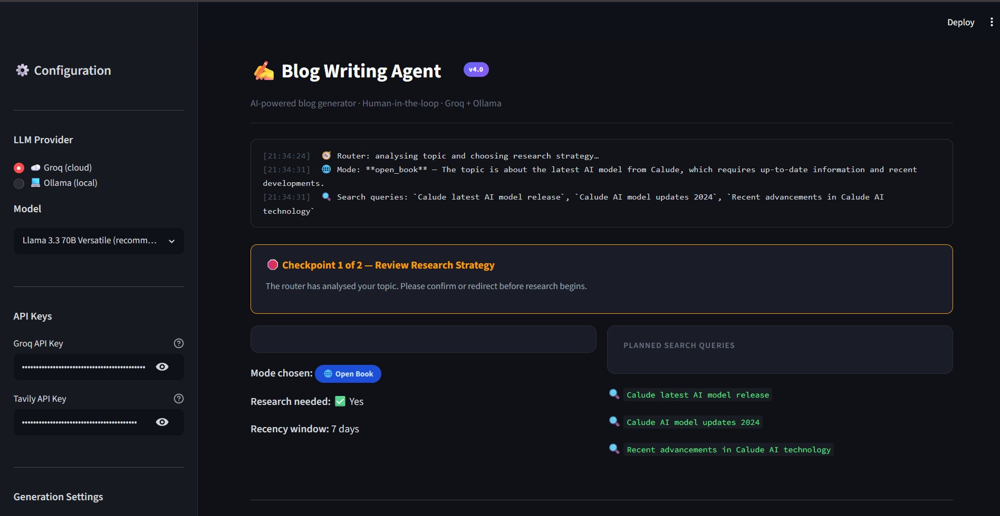
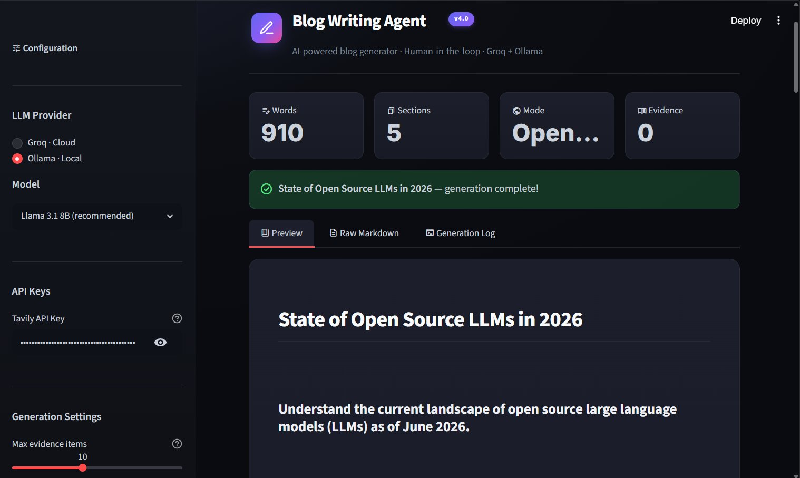
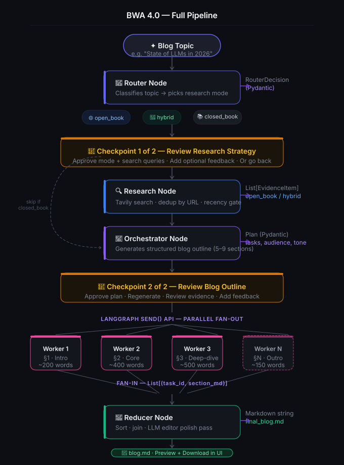

<div align="center">

<br/>


<br/><br/>

# ✍️ Blog Writing Agent

### Turn any topic into a fully researched, citation-grounded blog post - with you in the loop at every critical step.

*Multi-node agentic pipeline · Human-in-the-Loop · Groq & Ollama · Tavily web research*

<br/>

[**Quick Start**](#quick-start) &nbsp;·&nbsp; [**Architecture**](#architecture) &nbsp;·&nbsp; [**Screenshots**](#screenshots) &nbsp;·&nbsp; [**Version History**](#version-history) &nbsp;·&nbsp; [**Roadmap**](#roadmap)

<br/>

</div>

---

## What Is This?

**Blog Writing Agent (BWA)** is an end-to-end agentic pipeline that transforms a single blog topic into a polished, publication-ready Markdown post. It autonomously decides *how* to research the topic, plans a structured outline, writes each section in parallel, and assembles the final piece - all while keeping you in control at two critical Human-in-the-Loop checkpoints.

Built with [LangGraph](https://github.com/langchain-ai/langgraph) and [Streamlit](https://streamlit.io/), BWA evolved across **four progressive versions**. The final version (`BlogAgent-Final/`) is the flagship - a production-ready web app with dual LLM provider support, intelligent routing, live web research, and a rich dark-mode UI.

<br/>

---

## ✨ Highlights at a Glance

| Feature | Details |
|:---|:---|
| 🧭 **Smart Router** | Classifies your topic and picks the optimal research mode automatically |
| 🌐 **Live Web Research** | Tavily-powered search with recency filtering and URL deduplication |
| 🛑 **Human-in-the-Loop** | Two approval checkpoints - review strategy & outline before writing |
| ⚡ **Dual LLM Providers** | Switch between Groq (cloud) or Ollama (local) in one click |
| 🖊️ **Parallel Section Writing** | Workers write each blog section concurrently via LangGraph fan-out |
| 🔍 **Citation Grounding** | Evidence items are sourced, deduplicated, and woven into the blog |
| 🎨 **Polished Dark UI** | Streamlit app with gradient aesthetics, live logs, and blog preview |
| 📥 **One-Click Export** | Download the final post as a `.md` file instantly |

<br/>

---

## Screenshots

<table>
<tr>
<td width="50%" valign="top">

### Checkpoint 1 - Review Research Strategy

The Router analyses your topic, picks a research mode (`open_book` / `hybrid` / `closed_book`), and surfaces the planned Tavily search queries for your approval — before a single web request is made.

</td>
<td width="50%" valign="top">

### Generation Complete - Blog Preview

After writing, the app shows word count, section count, research mode, and a styled blog preview with tabs for Raw Markdown and the full Generation Log.

</td>
</tr>
<tr>
<td>



</td>
<td>



</td>
</tr>
</table>

<br/>

---

## Architecture

The pipeline follows the **Router → Research → Orchestrator → Workers (fan-out) → Reducer (fan-in)** agentic pattern, with two Human-in-the-Loop gates that give you full control before committing to expensive operations.



### The Three Research Modes

The **Router Node** classifies every topic automatically - no manual selection needed:

| Mode | When it applies | Recency window | Live research |
|:---|:---|:---:|:---:|
| `closed_book` | Evergreen concepts, fundamentals, theory | - | ❌ |
| `hybrid` | Mostly evergreen, benefits from recent examples or version names | 45 days | ✅ |
| `open_book` | Volatile topics - news, rankings, latest releases, policy changes | 7 days | ✅ |

### Node Breakdown

| Node | Role | Key output |
|:---|:---|:---|
| **Router** | Classifies topic → picks mode + generates search queries | `RouterDecision` |
| **Research** | Runs Tavily searches, filters & deduplicates evidence | `List[EvidenceItem]` |
| **Orchestrator** | Generates structured blog plan with 5–9 sections | `Plan` |
| **Worker × N** | Writes each section in parallel with evidence context | `(task_id, section_md)` |
| **Reducer** | Sorts sections, joins, runs an editor polish pass | `final_blog.md` |

<br/>

---

## Quick Start

### Prerequisites

- Python 3.10+
- [Ollama](https://ollama.com/) *(optional - for local inference)*
- A free [Groq API key](https://console.groq.com) *(recommended for speed)*
- A free [Tavily API key](https://tavily.com) *(required for web research)*

### Installation

```bash
# 1. Clone the repository
git clone https://github.com/Darsh-Nandu/Blog-Writing-Agent.git
cd Blog-Writing-Agent

# 2. Install dependencies
pip install -r requirements.txt

# 3. Set up your API keys
cp .env.example .env
# Edit .env and add:
#   GROQ_API_KEY=your_groq_key_here
#   TAVILY_API_KEY=your_tavily_key_here

# 4. (Optional) Pull a local Ollama model
ollama pull llama3.1

# 5. Launch the app
cd BlogAgent-Final
streamlit run app.py
```

The app opens at `http://localhost:8501` - enter a topic and click **Generate Blog**.

### CLI Usage (no UI)

```python
from nodes import run_pipeline

blog_md = run_pipeline(
    topic="State of open-source LLMs in 2026",
    provider="groq",                        # or "ollama"
    model_name="llama-3.3-70b-versatile",
)

print(blog_md)
```

<br/>

---

## Configuration

All settings live in the Streamlit sidebar - no code changes needed.

### LLM Providers

| Provider | Models | Best for |
|:---|:---|:---|
| **Groq · Cloud** | Llama 3.3 70B Versatile *(recommended)*, Llama 3.1 8B Instant, Mixtral 8×7B 32K, Gemma 2 9B | Speed, quality |
| **Ollama · Local** | Llama 3.1 8B *(recommended)*, Llama 3.2 3B, Mistral 7B, Phi-3 Mini, Gemma 2 9B, DeepSeek R1 7B | Privacy, offline use |

### Environment Variables

```env
GROQ_API_KEY=gsk_...        # Required for Groq provider
TAVILY_API_KEY=tvly-...     # Required for web research (hybrid / open_book modes)
```

<br/>

---

## Human-in-the-Loop Checkpoints

BWA 4.0 pauses at **two checkpoints** before committing to expensive operations.

### 🛑 Checkpoint 1 - Review Research Strategy

Triggered after routing. Shows:
- **Mode chosen** (Open Book / Hybrid / Closed Book)
- **Research needed** (Yes / No) and **recency window** (7 / 45 days)
- **Planned search queries** - exactly what will be sent to Tavily

Add optional feedback (*"add a query about LangGraph v0.4"*) before approving or going back to the topic.

### 🛑 Checkpoint 2 - Review Blog Outline

Triggered after the orchestrator generates the plan. Shows:
- Blog title, audience, tone, and estimated word count
- Every section card with goal, sub-bullets, word target, and flags (`code` / `citations` / `research`)
- Collected evidence items with source URLs and dates

**Approve**, **Regenerate the plan**, or **Go back** to tweak the research strategy.

<br/>

---

## Version History

<div align="center">

| Feature | BWA 1.0 | BWA 2.0 | BWA 3.0 | BWA 4.0 |
|:---|:---:|:---:|:---:|:---:|
| Core Orchestrator → Workers → Reducer | ✅ | ✅ | ✅ | ✅ |
| Parallel section writing | ✅ | ✅ | ✅ | ✅ |
| Structured section planning | ❌ | ✅ | ✅ | ✅ |
| Technical prompts (goals, bullets, word counts) | ❌ | ✅ | ✅ | ✅ |
| Routing (open_book / hybrid / closed_book) | ❌ | ❌ | ✅ | ✅ |
| Live web research (Tavily) | ❌ | ❌ | ✅ | ✅ |
| Citation grounding | ❌ | ❌ | ✅ | ✅ |
| Recency filtering | ❌ | ❌ | ✅ | ✅ |
| Externalized prompts | ❌ | ❌ | ✅ | ✅ |
| Human-in-the-Loop checkpoints | ❌ | ❌ | ❌ | ✅ |
| Streamlit web UI | ❌ | ❌ | ❌ | ✅ |
| Dual LLM provider (Groq + Ollama) | ❌ | ❌ | ❌ | ✅ |
| Blog preview + markdown download | ❌ | ❌ | ❌ | ✅ |
| Editor polish pass (reducer) | ❌ | ❌ | ❌ | ✅ |

</div>

**BWA 1.0** establishes the core **Orchestrator → Fan-Out → Fan-In** pattern with LangGraph. No research, no structured planning — but the essential pipeline is there.

**BWA 2.0** introduces structured section planning via Pydantic schemas. Each section gets a goal, word count, and sub-bullets. Workers now know *what* to write, not just *how much*.

**BWA 3.0** adds the Router node, Tavily integration, recency filtering, citation grounding, and externalized prompt modules in `prompts.py` for easy tuning.

**BWA 4.0** wraps the entire pipeline in a Streamlit UI with a polished dark-mode design, dual LLM provider support, two HITL checkpoints, live generation logs, blog preview tabs, and one-click `.md` download.

<br/>

---

## Sample Output

<details open>
<summary><strong>BWA 4.0 / 3.0</strong> - <em>"State of Open Source LLMs in 2026"</em> (open_book, research-grounded)</summary>

<br/>

> **Market Landscape & Leading Models**
>
> Open-source LLMs have reached near-parity with closed frontier models on a range of benchmarks.
> Meta's Llama 3 family continues to dominate downloads, while Mistral AI maintains strong community adoption.
>
> **Deployment & Inference Trends**
>
> The introduction of AI-native platforms has democratised access - quantised models running on consumer hardware
> are now a practical production path. vLLM and llama.cpp have become the de-facto serving stacks for
> self-hosted inference.

*All source URLs are real, fetched, and deduplicated. Workers cannot invent citations.*

</details>

<details>
<summary><strong>BWA 2.0</strong> - <em>"Mastering Self-Attention in Transformers"</em> (closed_book, technical deep-dive)</summary>

<br/>

> **The Self-Attention Mechanism**
>
> Self-attention computes relationships between every pair of tokens:
> `α = softmax(QK^T / √d_k) · V`
>
> ```python
> class ScaledDotProductAttention(nn.Module):
>     def forward(self, Q, K, V):
>         scores = torch.matmul(Q, K.transpose(-2, -1)) / math.sqrt(self.d_k)
>         weights = F.softmax(scores, dim=-1)
>         return torch.matmul(weights, V)
> ```

</details>

<br/>

---

## Repository Structure

```
Blog-Writing-Agent/
│
├── BWA_1.0/                    # v1 · Core fan-out/fan-in pipeline
│   ├── app.py
│   ├── nodes.py
│   ├── custom_objects.py
│   ├── requirements.txt
│   └── README.md
│
├── BWA_2.0/                    # v2 · Richer prompts, structured planning
│   ├── app.py
│   ├── nodes.py
│   ├── custom_objects.py
│   ├── BWA_2.0_test_1.md       ← sample output
│   ├── requirements.txt
│   └── README.md
│
├── BWA_3.0/                    # v3 · Router, Tavily research, citations
│   ├── app.py
│   ├── nodes.py
│   ├── custom_objects.py
│   ├── prompts.py
│   ├── requirements.txt
│   └── README.md
│
├── BlogAgent-Final/            # v4 · ⭐ FLAGSHIP — Streamlit UI + HITL
│   ├── app.py                  ← Streamlit app (UI + session flow)
│   ├── nodes.py                ← All pipeline nodes
│   ├── llm_factory.py          ← Groq + Ollama provider abstraction
│   ├── custom_objects.py       ← Pydantic schemas (State, Plan, Task, Evidence…)
│   └── prompts.py              ← All LLM system prompts
│
├── assets/                     ← Screenshots & diagrams
│   ├── screenshot_checkpoint.png
│   ├── screenshot_output.png
│   └── architecture.svg
│
├── requirements.txt
└── README.md                   ← This file
```

<br/>

---

## Tech Stack

<div align="center">

| | Tool | Version | Purpose |
|:---:|:---|:---:|:---|
| 🔗 | [LangGraph](https://github.com/langchain-ai/langgraph) | ≥ 0.2 | Agent graph, parallel fan-out, Send() API |
| 🦜 | [LangChain](https://github.com/langchain-ai/langchain) | ≥ 0.3 | LLM interface, structured output |
| ⚡ | [Groq](https://groq.com/) | ≥ 0.11 | Cloud LLM inference (ultra-fast) |
| 🦙 | [Ollama](https://ollama.com/) | any | Local LLM inference - fully offline |
| 🔍 | [Tavily](https://tavily.com/) | ≥ 0.3 | Live web research & evidence retrieval |
| 🛡️ | [Pydantic v2](https://docs.pydantic.dev/) | ≥ 2.0 | Typed schemas for all pipeline objects |
| 🎨 | [Streamlit](https://streamlit.io/) | ≥ 1.35 | Web UI with dark-mode design system |
| 🐍 | Python | 3.10+ | Runtime |

</div>

<br/>

---

## Roadmap

```
✅ BWA 1.0  - Core fan-out / fan-in pipeline
✅ BWA 2.0  - Structured prompts & section planning
✅ BWA 3.0  - Web research, routing, citation grounding
✅ BWA 4.0  - Human-in-the-Loop · Streamlit UI · Groq + Ollama

⬜ BWA 5.0  - Output quality evaluation node (auto-score)
⬜ BWA 5.0  - Multi-format export  (HTML · PDF · Notion · Medium)
⬜ BWA 5.0  - Persistent history & blog library
⬜ BWA 5.0  - Image generation per section (DALL-E / SDXL)
⬜ BWA 5.0  - Custom tone / style profiles
⬜ BWA 5.0  - Docker + one-command deploy
```

<br/>

---

## Contributing

Contributions are welcome! If you find a bug, have a feature idea, or want to improve the prompts:

1. Fork the repository
2. Create a feature branch: `git checkout -b feat/my-feature`
3. Commit your changes: `git commit -m "feat: add my feature"`
4. Push and open a Pull Request

<br/>

---

<div align="center">

MIT License &nbsp;·&nbsp; Built with ❤️ by [Darsh Nandu](https://github.com/Darsh-Nandu)

*Star ⭐ the repo if you find it useful!*

</div>
